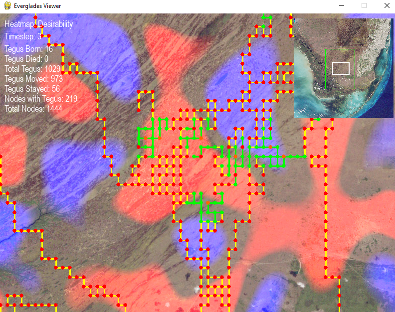

# Agent-Based Simulation of Invasive Tegu Population Dynamics

This project models the spread of invasive tegus in the Florida Everglades using a graph-based agent simulation with a Pygame viewer.

## Program View



## Running the Program

The Python entrypoint is [InvasiveTegus.py](InvasiveTegus.py).

Install the required Python packages:

```bash
py -3 -m pip install numpy pygame pillow scipy matplotlib
```

Run the viewer with:

```bash
py -3 InvasiveTegus.py
```

## Controls

- `W`, `A`, `S`, `D`: pan around the map
- Mouse wheel: zoom in and out
- Left click on a node to display information
- `Space`: advance the simulation by one timestep
- `H`: cycle between no heatmap, desirability heatmap, and tegu-count heatmap
- Close the window: exit the program

## Output

Each time you press `Space`, the program advances the simulation by one timestep and saves a frame image into a `frames/` folder. Those saved frames can be combined into GIFs like the ones included in [GIFS](GIFS).

---

## Writeup
    

### Overview

The following writeup describes a personal project that uses graph theory in the context of mathematical biology. The model is not intended to be fully biologically accurate. Instead, it serves as an exercise and example of how graph-based methods can be applied to ecological modeling.

Argentine black and white tegus (*Salvator merianae*) are a rapidly spreading invasive species in the Florida Everglades. These lizards can threaten native ecosystems by preying on local species and competing for resources. For background, see this ecological study: [Ecosphere DOI](https://doi.org/10.1002/ecs2.3579).

This project explores a simplified agent-based simulation to show how graph theory and spatial modeling techniques can be used to study invasive spread.

### Methodology

The model was implemented in Python using `pygame` for visualization and interaction, along with NumPy and SciPy for numerical operations. A satellite image of the Florida Everglades was overlaid with a spatially aligned grid system.

We began with a 100 x 100 uniform grid of candidate nodes. This full grid was not used directly. Instead, we built a connected subgraph by activating nodes and edges through a selective, desirability-driven expansion process.

To simulate habitat variability, we created a scalar field that assigns a "desirability score" to each location. This field is constructed by filtering random noise with a Gaussian kernel and then applying histogram equalization to produce a smooth but structured distribution. Let `D(x, y)` represent the desirability value at coordinates `(x, y)`. For each node, we sample `D` to assign its desirability score.

We then select a small set of highly desirable seed nodes:

```text
S = {s1, s2, ..., sk}
```

These are chosen to be spatially separated and high in desirability. From each seed node, we grow a region by performing a random walk that preferentially activates nodes in more desirable areas. Edges between nodes are formed in a similar way, and each edge receives a desirability weight sampled from `D` at its midpoint.

#### Graph Generation

Graph generation proceeds in four steps:

1. Create the scalar desirability field `D(x, y)`.
2. Choose `k` seed nodes `S` from high-desirability areas.
3. Perform desirability-weighted random walks from each `si` to activate connected nodes.
4. Connect seed regions with stochastic paths to ensure overall connectivity.

The resulting graph is a biologically inspired subset of the full grid, focusing computational effort on plausible habitat.

#### Tegu Agent Behavior

Each tegu agent is characterized by:

- Current position: `(i, j)`
- Age: `a`
- Lifespan: `L`, randomly selected from 15 to 20 timesteps

At each timestep, the agent decides whether to move based on edge desirability and crowding at neighboring nodes. The probability of moving to a neighboring node `v` is:

```text
P(v) proportional to desirability_(i,j)->v * (1 + (100 - population_v) / 20)
```

Where:

- `desirability_(i,j)->v` is the edge desirability between the current node and `v`
- `population_v` is the number of tegus currently at node `v`

This gives higher preference to edges that are both desirable and lead to less crowded destinations.

If an agent's age reaches its lifespan (`a >= L`), it is removed from the simulation. Reproduction occurs if a node has at least 2 tegus. A new tegu is added with probability:

```text
P_birth = max(0.05, 1 - n / 20)
```

Where `n` is the current number of tegus at the node.

This discourages reproduction in highly crowded areas, promoting expansion into underused habitat.

### Results

For full results, see the four supplementary GIFs included with this repository.

For visualization, the simulation saves a snapshot of the scalar field and desirability field at each timestep. External software was then used to combine those snapshots into GIFs. The first two simulations show 50 and 100 timesteps using Seed 1. The latter two show 100 and 500 timesteps using Seed 2. Even when the same random seed is reused, the stochastic graph-generation process means the resulting graphs are not identical across runs.

#### Seed 1: 50 and 100 Timesteps


*Figure 8: 50 time-step simulation using Seed 1.*


*Figure 9: 100 time-step simulation using Seed 1.*

#### Seed 2: 100 and 500 Timesteps


*Figure 10: 100 time-step simulation using Seed 2.*


*Figure 11: 500 time-step simulation using Seed 2.*

#### Interpretation of Results

Despite the stochastic nature of graph generation, simulations using the same desirability seed consistently converged toward similar steady-state distributions. Seed 2 illustrates this most clearly: both the 100- and 500-timestep runs display very similar final configurations, suggesting that the dynamics are robust even when the graph structure changes from run to run.

The 500-timestep simulation appeared to stabilize around steps 200 to 300, with little visible change in population spread afterward.

This behavior is reminiscent of steady-state solutions in differential equation models, but here it emerges from discrete agent-based interactions governed by simple rules. The simulations also show that tegu agents tend to spread relatively evenly across habitat over time. No single area maintains an unusually high population because crowding penalties and desirability values both influence movement and reproduction. Together, these results suggest that the model naturally promotes equilibrium-like behavior even under randomness in both environment structure and agent decision-making.

### Suggestions for Improvement

A major simplification in this project is the use of artificial Gaussian noise to model habitat desirability. A more biologically grounded approach would incorporate real ecological data such as land cover type, proximity to water, or human infrastructure, all of which could influence tegu movement and habitat selection.

Parameter tuning for reproduction, mortality, and movement could also be improved using field studies or telemetry data. Introducing stochastic variability in environment quality or seasonal effects would further improve realism.

### Project Conclusion

This project demonstrates how graph theory provides a useful framework for modeling ecological dynamics, even in simplified settings. By representing spatial structure with a graph and agent behavior as probabilistic transitions over that graph, we gain a flexible platform for simulating biological processes. While not biologically precise, this model offers a concrete example of how mathematical tools can be applied to real-world ecological questions in mathematical biology.
